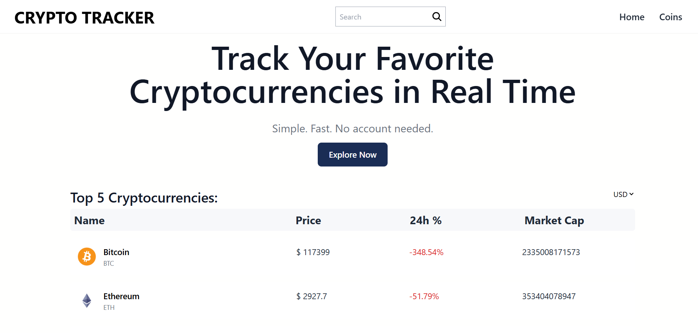
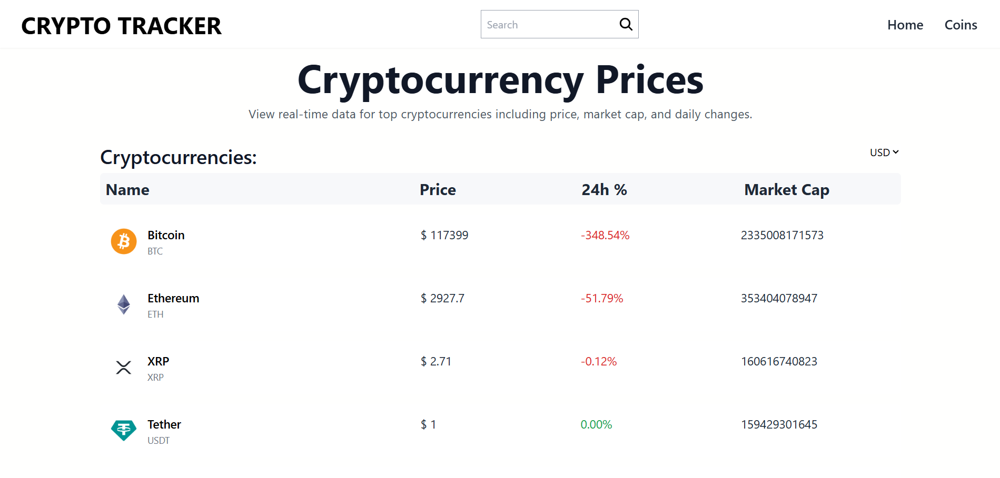
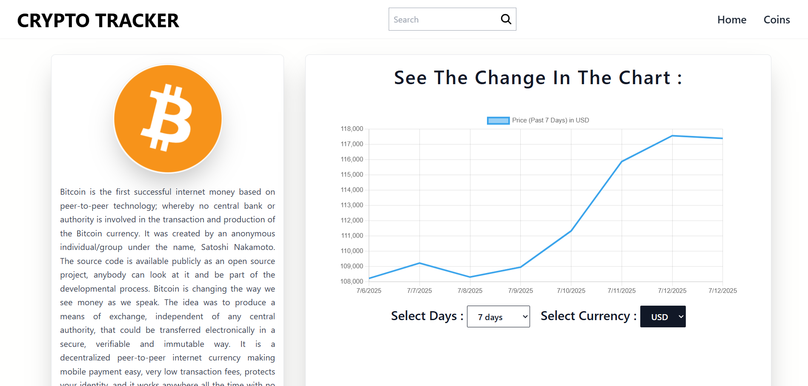

# 💰 Crypto Tracker

A sleek and responsive cryptocurrency tracker web app built with **React**, **Tailwind CSS**, and **React Query**. It provides real-time market data, live prices, market cap, and more for top cryptocurrencies. 🪙

---

## 🌐 Live Demo

[🔗 View Live Site](https://crypto-tracker-rho-nine.vercel.app/) <!-- Replace this with your deployed link -->

---

## 📸 Screenshots

### 🖼️ Homepage

 <!-- Replace with your actual image path -->

---

### 🖼️ Coin Table Page

 <!-- Replace with your actual image path -->

---

### 🖼️ Coin Details Page

 <!-- Replace with your actual image path -->

---

## 🚀 Features

- 🔍 Search for coins
- 💸 Live price updates
- 📊 Coin detail with charts (optional)
- 📱 Responsive UI for all screen sizes
- 🌎 Currency switch (USD/INR)

---

## 🛠️ Tech Stack

- **React**
- **Tailwind CSS**
- **React Router**
- **React Query**
- **Axios**
- **Zustand**

---

## 📁 Project Structure

```plaintext
src/
│
├── components/
├── pages/
├── Services/
├── Store/
├── Helpers/
├── App.jsx
└── main.jsx
# 💰 Crypto Tracker

A sleek and responsive cryptocurrency tracker web app built with **React**, **Tailwind CSS**, and **React Query**. It provides real-time market data, live prices, market cap, and more for top cryptocurrencies. 🪙

---

## 🌐 Live Demo

[🔗 View Live Site](https://your-live-site-link.com) <!-- Replace this with your deployed link -->

---

## 📸 Screenshots

### 🖼️ Homepage

 <!-- Replace with your actual image path -->

---

### 🖼️ Coin Table Page

 <!-- Replace with your actual image path -->

---

### 🖼️ Coin Details Page

 <!-- Replace with your actual image path -->

---

## 🚀 Features

- 🔍 Search for coins
- 💸 Live price updates
- 📊 Coin detail with charts (optional)
- 📱 Responsive UI for all screen sizes
- 🌎 Currency switch (USD/INR)

---

## 🛠️ Tech Stack

- **React**
- **Tailwind CSS**
- **React Router**
- **React Query**
- **Axios**
- **Zustand**

---

## 📁 Project Structure

```plaintext
src/
│
├── components/
├── pages/
├── Services/
├── Store/
├── Helpers/
├── App.jsx
└── main.jsx
